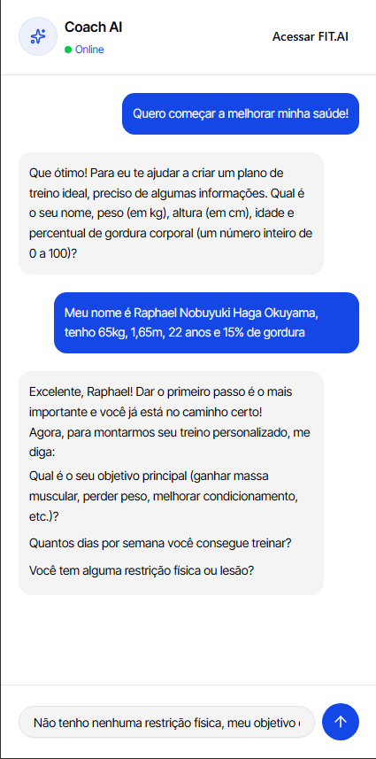
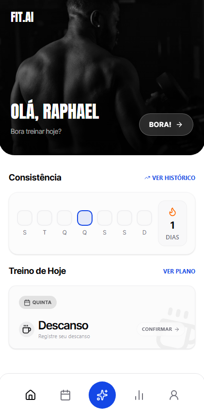
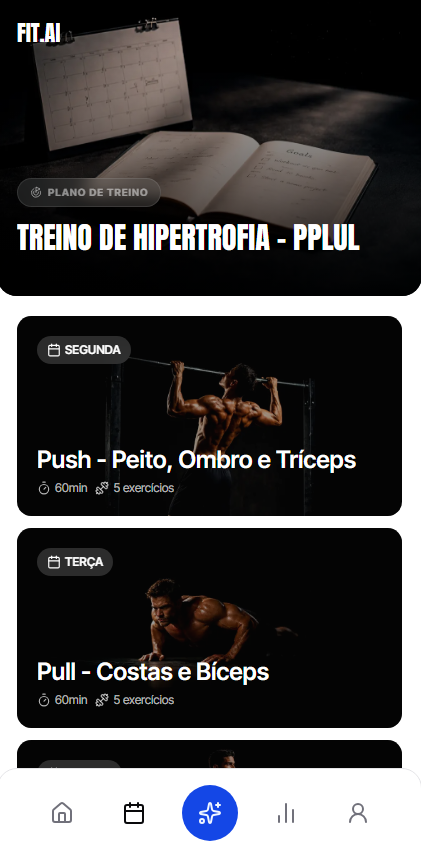
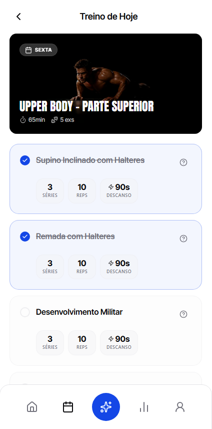
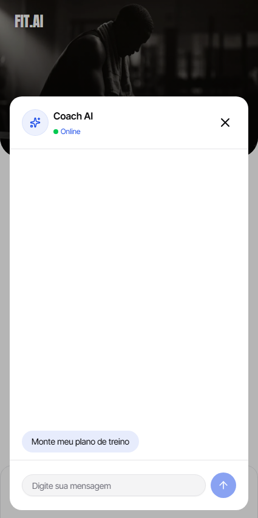
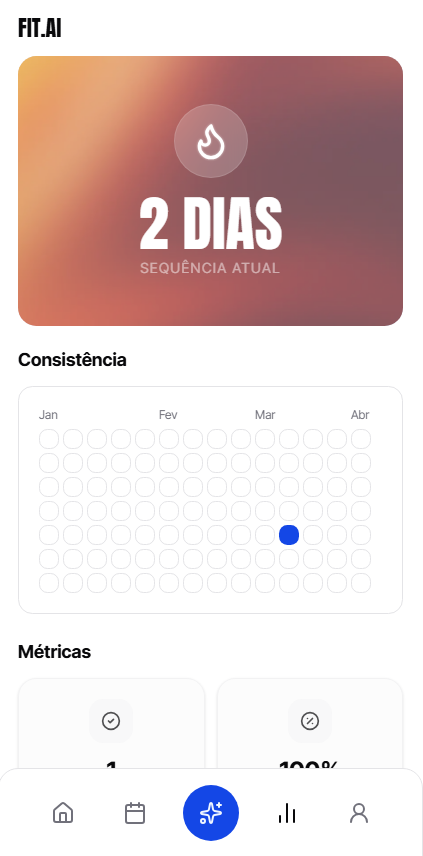
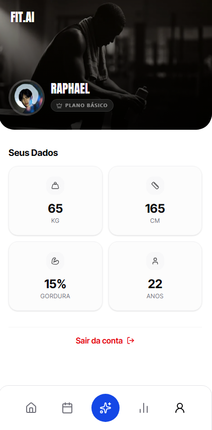

# 🏋️ FIT.AI — Frontend

Interface mobile-first do **FIT.AI**, um aplicativo de gestão de treinos com personal trainer virtual integrado. Desenvolvido com **Next.js 16**, **TypeScript** e **Tailwind CSS v4**, o app oferece uma experiência fluida e moderna para o usuário acompanhar seus treinos, visualizar estatísticas e interagir com um coach de IA em tempo real.

🔗 **Deploy:** [gestao-de-treino-frontend.onrender.com](https://gestao-de-treino-frontend.onrender.com/auth)
⚙️ **Repositório da API:** [gestao-de-treino-api](https://github.com/RaphaelOkuyama/gestao-de-treino-api)

---

## 📸 Screenshots

<div align="center">

| Login | Onboarding com IA | Home |
|-------|------------------|------|
|  |  |  |

| Plano de Treino | Treino do Dia | Chatbot |
|----------------|--------------|---------|
|  |  |  |

| Estatísticas | Perfil |
|-------------|--------|
|  |  |

</div>

---

## 📝 Descrição

O FIT.AI é uma **Single Page Application mobile-first** construída com **Next.js 16 (App Router)**. O foco principal foi criar uma experiência de usuário imersiva para dispositivos móveis, com navegação por bottom nav, animações suaves e integração direta com a API de treinos.

O projeto utiliza **Server Components** para busca de dados no servidor, **Server Actions** para mutações e **Client Components** apenas onde há interatividade. A comunicação com a API é gerada automaticamente via **Orval** a partir do schema OpenAPI.

> ⚠️ **Atenção:** O app foi projetado exclusivamente para **dispositivos móveis**. Em telas desktop, o layout pode não apresentar a melhor experiência visual.

---

## ⚠️ Limitação de Autenticação no Deploy

O login com Google **não funciona no ambiente de deploy** (Render) devido a uma limitação do **Better Auth** com cookies cross-domain.

O Better Auth utiliza cookies de sessão que precisam compartilhar o mesmo domínio (ou subdomínio) entre o frontend e a API. Como o Render atribui domínios públicos independentes para cada serviço (ex: `frontend.onrender.com` e `api.onrender.com`), os cookies não são transmitidos corretamente entre os dois, impedindo o fluxo OAuth.

**Em ambiente local**, com o frontend em `localhost:3000` e a API em `localhost:8080`, o login funciona normalmente.

---

## ✨ Funcionalidades

### 🔐 Autenticação
- Login com **Google OAuth** via Better Auth
- Redirecionamento automático para onboarding ou home após autenticação
- Logout com limpeza de sessão

### 🤖 Onboarding Inteligente com IA
- Na primeira entrada, o usuário é redirecionado para um chat com o **Coach AI**
- A IA coleta nome, peso, altura, idade e % de gordura de forma conversacional
- Após salvar os dados, já pergunta objetivo, dias disponíveis e restrições para montar o plano

### 💬 Coach AI (Chat em Tempo Real)
- Chat com personal trainer virtual powered by **Google Gemini 2.5 Flash**
- Respostas em **streaming** com animação de renderização via `Streamdown`
- Acessível via botão flutuante na bottom nav em qualquer tela
- Sugestões de mensagens rápidas na primeira abertura
- Pode ser aberto com mensagem inicial pré-definida (ex: "Como executar o exercício X?")
- Estado do chat gerenciado via **query params** com `nuqs`

### 🏠 Home Personalizada
- Banner com saudação pelo nome do usuário
- Mensagem motivacional dinâmica baseada no streak atual
- Card do treino do dia com imagem, duração e número de exercícios
- Tracker de consistência semanal com quadrados coloridos (concluído / iniciado / hoje / vazio)
- Indicador de streak com efeito de chama animada

### 📋 Plano de Treino Semanal
- Listagem de todos os dias da semana com cards visuais
- Cards de treino com imagem de capa, duração estimada e contagem de exercícios
- Cards de descanso com visual diferenciado
- Ordenação automática de segunda a domingo

### 🏋️ Treino do Dia
- Detalhes do dia com imagem de capa, duração e lista de exercícios
- Botão **Iniciar Treino** disponível apenas no dia correto da semana
- Dias bloqueados exibem badge "Bloqueado"
- Cada exercício exibe: séries, repetições e tempo de descanso
- Exercícios marcáveis como concluídos via `localStorage`
- Botão de ajuda em cada exercício abre o chat com pergunta pré-definida sobre execução
- Botão **Marcar como Concluído** finaliza a sessão via Server Action

### 📊 Estatísticas
- Banner de streak com efeito de intensidade visual dinâmica (chama mais intensa conforme streak aumenta)
- Heatmap de consistência dos últimos 3 meses (inspirado no GitHub)
- Cards de métricas: treinos concluídos, taxa de conclusão e tempo total treinado

### 👤 Perfil
- Avatar e nome do usuário
- Grid com dados físicos: peso (kg), altura (cm), % de gordura e idade
- Botão de logout

---

## 🛠️ Tecnologias

### Core
-  **Next.js 16** – Framework React com App Router, Server Components e Server Actions
-  **React 19** – Biblioteca para construção de interfaces
-  **TypeScript 5** – Tipagem estática

### Estilização
-  **Tailwind CSS v4** – Estilização utilitária com tema customizado (claro e escuro)
- **shadcn/ui** – Componentes acessíveis: Avatar, Button, Input, Form, Badge, Card e Label
- **tw-animate-css** – Animações utilitárias para Tailwind

### IA & Chat
- **@ai-sdk/react** – Hook `useChat` para chat com streaming
- **Streamdown** – Renderização animada de markdown em tempo real durante o streaming

### Formulários & Validação
- **React Hook Form** – Gerenciamento de formulários performático
- **Zod + @hookform/resolvers** – Validação de schemas com inferência de tipos

### Roteamento & Estado
- **nuqs** – Gerenciamento de estado via query params (estado do chat)
- **dayjs** – Manipulação de datas

### API & Autenticação
- **Orval** – Geração automática de funções de fetch tipadas a partir do schema OpenAPI da API
- **Better Auth** – Autenticação com Google OAuth e gerenciamento de sessão

### Fontes
- **Anton** – Títulos e destaques (estilo fitness/bold)
- **Inter Tight** – Textos e labels
- **Geist Sans / Mono** – Interface geral

---

## 🗂️ Estrutura de Pastas

```bash
gestao-de-treino-frontend/
├── public/                          # Assets estáticos (banners, ícones, imagens)
│   ├── home-banner.jpg
│   ├── login-bg.jpg
│   ├── profile-banner.jpg
│   ├── stats-banner.png
│   ├── workout-plan-banner.png
│   └── google-icon.svg
├── src/
│   ├── app/
│   │   ├── layout.tsx               # Layout raiz — fontes, NuqsAdapter, Chat global
│   │   ├── globals.css              # Tokens de tema (CSS custom properties claro/escuro)
│   │   ├── page.tsx                 # Home — treino do dia, streak, consistência
│   │   ├── auth/
│   │   │   └── page.tsx             # Tela de login com Google
│   │   ├── onboarding/
│   │   │   └── page.tsx             # Chat de onboarding com IA
│   │   ├── profile/
│   │   │   └── page.tsx             # Perfil do usuário com dados físicos
│   │   ├── stats/
│   │   │   └── page.tsx             # Estatísticas: streak, heatmap, métricas
│   │   ├── workout-plans/
│   │   │   └── [id]/
│   │   │       ├── page.tsx         # Plano de treino semanal com todos os dias
│   │   │       └── days/
│   │   │           └── [dayId]/
│   │   │               └── page.tsx # Treino do dia com exercícios e sessão
│   │   └── _lib/
│   │       ├── auth-client.ts       # Cliente Better Auth
│   │       └── api/
│   │           ├── fetch-generated/ # Funções de fetch geradas pelo Orval
│   │           └── custom-fetch.ts  # Fetch customizado com cookies SSR
│   └── _components/                 # Componentes globais reutilizáveis
│       ├── bottom-nav.tsx           # Navegação inferior (Home, Plano, Chat, Stats, Perfil)
│       ├── chat.tsx                 # Componente de chat com IA (floating + embedded)
│       ├── chat-open-button.tsx     # Botão flutuante que abre o chat
│       ├── consistency-tracker.tsx  # Tracker semanal de consistência
│       ├── consistency-square.tsx   # Quadrado individual do tracker
│       ├── workout-day-card.tsx     # Card visual de um dia de treino
│       └── rest-day-card.tsx        # Card de dia de descanso
├── .env.example
├── next.config.ts
├── tailwind.config.ts
├── tsconfig.json
└── package.json
```

---

## 🚀 Como Rodar Localmente

### Pré-requisitos

- **Node.js** v20+
- **npm** ou **pnpm**
- API rodando localmente → [gestao-de-treino-api](https://github.com/RaphaelOkuyama/gestao-de-treino-api)

### Passo a passo

**1. Clone o repositório**
```bash
git clone https://github.com/RaphaelOkuyama/gestao-de-treino-frontend.git
cd gestao-de-treino-frontend
```

**2. Instale as dependências**
```bash
npm install
```

**3. Configure as variáveis de ambiente**
```bash
cp .env.example .env.local
```

```env
# URL da API (deve estar rodando localmente)
NEXT_PUBLIC_API_URL=http://localhost:8080

# URL do próprio frontend (usada no callback do OAuth)
NEXT_PUBLIC_BASE_URL=http://localhost:3000
```

**4. Inicie o servidor de desenvolvimento**
```bash
npm run dev
```

O app estará disponível em: `http://localhost:3000`

> 💡 Certifique-se de que a API está rodando em `http://localhost:8080` antes de iniciar o frontend.

---

## 📦 Scripts Disponíveis

| Script | Descrição |
|--------|-----------|
| `npm run dev` | Inicia o servidor em modo de desenvolvimento |
| `npm run build` | Cria a versão otimizada para produção |
| `npm start` | Inicia o servidor de produção |
| `npm run lint` | Executa a verificação de código (ESLint) |

---

## 📬 Contato

Desenvolvido por **Raphael Okuyama**

- 🌐 Portfólio: [portfolio-raphael-okuyama.vercel.app](https://portfolio-raphael-okuyama.vercel.app)
- 💼 LinkedIn: [raphael-okuyama](https://www.linkedin.com/in/raphael-okuyama/)
- 🐙 GitHub: [@RaphaelOkuyama](https://github.com/RaphaelOkuyama)

---

## 📄 Licença

Este projeto está licenciado sob a **MIT License**. Consulte o arquivo [LICENSE](./LICENSE) para mais detalhes.

---

Copyright © 2026 **Raphael Okuyama**